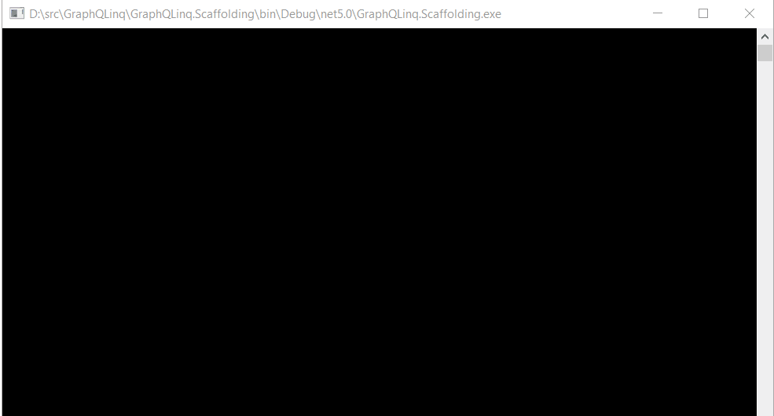

# GraphQLinq

LINQ to GraphQL - Strongly typed GraphQL queries with LINQ query syntax.

[](License.md)
[](https://ci.appveyor.com/project/Giorgi/graphqlinq)
[](https://coveralls.io/github/Giorgi/graphqlinq)
[](https://ko-fi.com/U6U81LHU8)


- [About The Project](#about-the-project)
- [Getting Started](#getting-started)
  - [Installing Scaffolding Tool](#installing-scaffolding-tool)
  - [Scaffolding Client Code](#scaffolding-client-code)
  - [Install GraphQLinq NuGet Package](#install-graphqlinq-nuget-package)
- [Running GraphQL Queries with LINQ](#running-graphql-queries-with-linq)
  - [Query all Primitive Properties of a Type](#query-all-primitive-properties-of-a-type)
  - [Query Specific Properties](#query-specific-properties)
  - [Include Navigation Properties](#include-navigation-properties)
  - [Pass Parameters to Queries and Compose Queries](#pass-parameters-to-queries-and-compose-queries)
  - [Include Multiple Levels of Navigation Properties](#include-multiple-levels-of-navigation-properties)
  - [View Generated Query](#view-generated-query)
- [Roadmap](#roadmap)
- [Contributing](#contributing)
- [License](#license)

## About The Project

GraphQLinq is a .NET tool for generating C# classes from a GraphQL endpoint and a .Net Standard library for writing strongly typed GraphQL queries with LINQ.

With GraphQLinq you will:

- Write strongly typed queries with LINQ.
- Have your queries checked by the compiler.
- Run queries and deserialize JSON response into strongly typed classes in a single method call.
- View queries generated by LINQ to GraphQL.

## Getting Started

### Install Scaffolding Tool

Before you starting writing queries, you need to generate classes from GraphQL types. This is done by `GraphQLinq.Scaffolding`, a .NET tool that is part of this project.

To get the tool, open your favourite command shell and run

```sh
dotnet tool install --global --version 1.0.0-beta GraphQLinq.Scaffolding
```

Running this command will install the `GraphQLinq.Scaffolding` tool and make it available globally for all projects.

### Scaffolding Client Code

Next, navigate to the project where you want to add the classes and scaffold the client code. In this example, I will use the [SpaceX GraphQL Api](https://api.spacex.land/graphql) so run the following command:

```sh
graphqlinq-scaffold https://api.spacex.land/graphql -o SpaceX -n SpaceX
```

The `o` option specifies the output directory for generated classes, and `n` specifies the namespace of the classes.



### Install GraphQLinq NuGet Package

Before writing the queries, you need to install the LINQ to GraphQL client library from NuGet. Run the following command to install it in the current project:

```sh
dotnet add package GraphQLinq.Client --version 1.0.0-beta
```

## Running GraphQL Queries with LINQ

The scaffolding tool generates classes for types available in the GraphQL type system and a `QueryContext` class that serves as an entry point for running the queries. GraphQLinq supports running different kinds of queries.

### Query all Primitive Properties of a Type

To query all properties of a type, simply run a query like this:

```cs
var spaceXContext = new QueryContext();

var company = spaceXContext.Company().ToItem();

RenderCompanyDetails(company);
```

This will query all primitive and string properties of `Company`, but it won't query nested properties or collection type properties. Here is the output of the code snippet:

```sh
┌───────────┬──────────────────────────────────────────────────────────────────────────────────────────────────────────┐
│ Property  │ Value                                                                                                    │
├───────────┼──────────────────────────────────────────────────────────────────────────────────────────────────────────┤
│ Name      │ SpaceX                                                                                                   │
│ Ceo       │ Elon Musk                                                                                                │
│ Summary   │ SpaceX designs, manufactures and launches advanced rockets and spacecraft. The company was founded in    │
│           │ 2002 to revolutionize space technology, with the ultimate goal of enabling people to live on other       │
│           │ planets.                                                                                                 │
│ Founded   │ 2002                                                                                                     │
│ Founder   │ Elon Musk                                                                                                │
│ Employees │ 7000                                                                                                     │
└───────────┴──────────────────────────────────────────────────────────────────────────────────────────────────────────┘
```

### Query Specific Properties

If you want to query specific properties, including a navigation property, you can specify it with the `Select` method. You either map the projection to an existing type or an anonymous object (`Headquarters` is a nested property):

```cs
var companySummaryAnonymous = spaceXContext.Company().Select(c => new { c.Ceo, c.Name, c.Headquarters }).ToItem();

//Use data class to select specific properties
var companySummary = spaceXContext.Company().Select(c => new CompanySummary
{
    Ceo = c.Ceo,
    Name = c.Name,
    Headquarters = c.Headquarters
}).ToItem();

RenderCompanySummary(companySummary);
```

This will result in the following output:

```sh
┌──────────────┬─────────────────┐
│ Property     │ Value           │
├──────────────┼─────────────────┤
│ Name         │ SpaceX          │
│ Ceo          │ Elon Musk       │
│ Headquarters │ ┌─────────────┐ │
│              │ │ California  │ │
│              │ │ Hawthorne   │ │
│              │ │ Rocket Road │ │
│              │ └─────────────┘ │
└──────────────┴─────────────────┘
```

### Include Navigation Properties

You can also query navigation properties using the `Include` method. You can include several properties if you need, and you can also `Include` nested navigation properties:

```cs
var companyWithHeadquartersAndLinks = spaceXContext.Company()
                                            .Include(info => info.Headquarters)
                                            .Include(info => info.Links).ToItem();

RenderCompanyDetailsAndLinks(companyWithHeadquartersAndLinks);
```

### Pass Parameters to Queries and Compose Queries

If the query has parameters, the generated method will have a parameter for each query parameter.

This code will query for all `Missions` that included **Orbital ATK** as a manufacturer. It also builds a new query over the existing one that
includes `Payloads` in the result.

```cs
var missionsQuery = spaceXContext.Missions(new MissionsFind { Manufacturer = "Orbital ATK" }, null, null)
                                 .Include(mission => mission.Manufacturers);
var missions = missionsQuery.ToList();

RenderMissions(missions);

var missionsWithPayloads = missionsQuery.Include(mission => mission.Payloads).ToList();

RenderMissions(missionsWithPayloads, true);
```

### Include Multiple Levels of Navigation Properties

The `Include` method allows quering for multi-level nested properties too. For example, here is how to query for `Launches` and include Rocket's second stage payload manufacturer:

```cs
//Launch_date_unix and Static_fire_date_unix need custom converter
spaceXContext.ContractResolver = new SpaceXContractResolver();

var launches = spaceXContext.Launches(null, 10, 0, null, null)
                            .Include(launch => launch.Links)
                            .Include(launch => launch.Rocket)
                            .Include(launch => launch.Rocket.Second_stage.Payloads.Select(payload => payload.Manufacturer))
                            .ToList();

RenderLaunches(launches);
```

### View Generated Query

You can view the GraphQL query and variables by using the `Query` and `Variables` property of the `GraphQuery` class. The `ToString()` method of the `GraphQuery` class returns the query and the variables combined:

```cs
var missionsQuery = spaceXContext.Missions(new MissionsFind { Manufacturer = "Orbital ATK" }, null, null)
                                 .Include(mission => mission.Manufacturers);

var query = missionsQuery.Query;
var fullQuery = missionsQuery.ToString();
```

If you run the above code `query` will be equal to

```js
query ($find: MissionsFind) { result: missions (find: $find) { 
  description
  id
  name
  twitter
  website
  wikipedia
  manufacturers
 }}
```

and the content of `fullQuery` will be:

```json
{"query":"query ($find: MissionsFind) { result: missions (find: $find) { 
  description
  id
  name
  twitter
  website
  wikipedia
  manufacturers
 }}","variables":{"find":{"manufacturer":"Orbital ATK"}}}
```

## Roadmap

See the [open issues](https://github.com/Giorgi/GraphQLinq/issues) for a list of proposed features and known issues.

## Contributing

If you encounter a bug or have a feature request, please use the [Issue Tracker](https://github.com/Giorgi/GraphQLinq/issues/new). The project is also open to contributions, so feel free to fork the project and open pull requests.

## License

Copyright © Giorgi Dalakishvili

Distributed under the Apache License. See [License](License.md) for more information.
