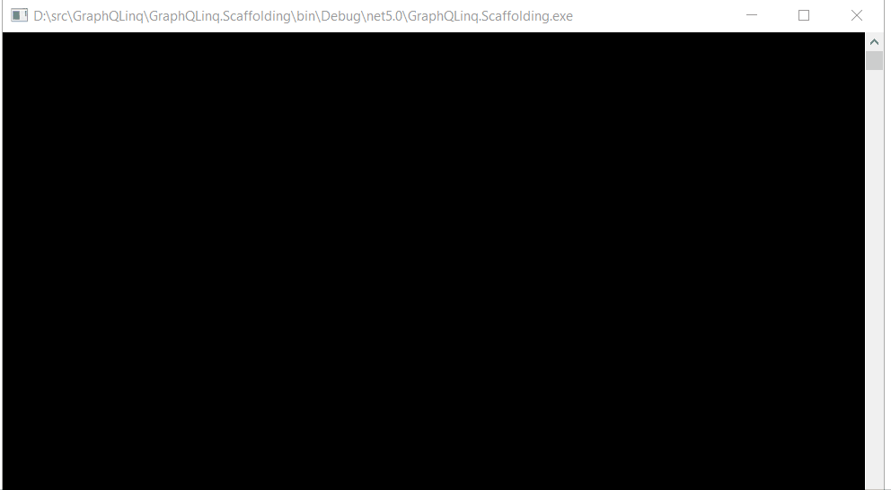

# GraphQLinq

LINQ to GraphQL - Strongly typed GraphQL queries with LINQ query syntax.


## About The Project

GraphQLinq is a .NET tool for generating C# classes from a GraphQL endpoint and a C# library for writing strongly typed GraphQL queries with LINQ.

With GraphQLinq you will:

- Write strongly typed queries with LINQ.
- Have your queries checked by the compiler.
- Run queries and deserialize response into strongly typed classes in a single method call.

## Getting Started

### Installing Scaffolding Tool

Before you starting writing queries, you need to generate classes from GraphQL types. This is done by `GraphQLinq.Scaffolding`, a .NET tool that is part of the project.

To get the tool, open your favourite command shell and run

```sh
dotnet tool install --global GraphQLinq.Scaffolding
```

This will install the `GraphQLinq.Scaffolding` tool and make it available globally for all projects.

### Scaffolding Client Code

Next, navigate to the project where you want to add the classes and scaffold the client code. In this example I will use the [SpaceX GraphQL Api](https://api.spacex.land/graphql) so run the following command:

```sh
dotnet tool run graphql-scaffold https://api.spacex.land/graphql -o SpaceX -n SpaceX
```

The `o` option specifies the output directory for generated classes and `n` specifies the namespace of the classes.



## Running GraphQL Queries with LINQ

The scaffolding tool generates classes for types available in the GraphQL type system and a `QueryContext` class that serves as an entry point for running the queries. GraphQLinq supports running different types of queries.

### Query all Primitive Properties of a Type

To query all properties of a type simply run a query like this:

```cs
var spaceXContext = new QueryContext();

var company = spaceXContext.Company().ToItem();

RenderCompanyDetails(company);
```

This will query all primitive and string properties of `Company` but it won't query nested properties or collection type properties. Here is the output of the code snippet:

```sh
┌───────────┬──────────────────────────────────────────────────────────────────────────────────────────────────────────┐
│ Property  │ Value                                                                                                    │
├───────────┼──────────────────────────────────────────────────────────────────────────────────────────────────────────┤
│ Name      │ SpaceX                                                                                                   │
│ Ceo       │ Elon Musk                                                                                                │
│ Summary   │ SpaceX designs, manufactures and launches advanced rockets and spacecraft. The company was founded in    │
│           │ 2002 to revolutionize space technology, with the ultimate goal of enabling people to live on other       │
│           │ planets.                                                                                                 │
│ Founded   │ 2002                                                                                                     │
│ Founder   │ Elon Musk                                                                                                │
│ Employees │ 7000                                                                                                     │
└───────────┴──────────────────────────────────────────────────────────────────────────────────────────────────────────┘
```

### Query Specific Properties

If you want to query specific properties, including a navigation property, you can specify it with the `Select` method. You either map the projection to an existing type or an anonymous object (`Headquarters` is a nested property):

```cs
var companySummaryAnonymous = spaceXContext.Company().Select(c => new { c.Ceo, c.Name, c.Headquarters }).ToItem();

//Use data class to select specific properties
var companySummary = spaceXContext.Company().Select(c => new CompanySummary
{
    Ceo = c.Ceo,
    Name = c.Name,
    Headquarters = c.Headquarters
}).ToItem();

RenderCompanySummary(companySummary);
```

This will result in the following output:

```sh
┌──────────────┬─────────────────┐
│ Property     │ Value           │
├──────────────┼─────────────────┤
│ Name         │ SpaceX          │
│ Ceo          │ Elon Musk       │
│ Headquarters │ ┌─────────────┐ │
│              │ │ California  │ │
│              │ │ Hawthorne   │ │
│              │ │ Rocket Road │ │
│              │ └─────────────┘ │
└──────────────┴─────────────────┘
```

### Include Navigation Properties

You can also query navigation properties using the `Include` method. You can include several properties if you need, and you can also `Include` nested navigation properties:

```cs
var companyWithHeadquartersAndLinks = spaceXContext.Company()
                                            .Include(info => info.Headquarters)
                                            .Include(info => info.Links).ToItem();

RenderCompanyDetailsAndLinks(companyWithHeadquartersAndLinks);
```

### Pass Parameters to Queries and Compose Queries

If the query has parameters, the generated method will have a parameter for each query parameter.

This code will query for all `Missions` that were include **Orbital ATK** as a manufacturer:

```cs
var missionsQuery = spaceXContext.Missions(new MissionsFind { Manufacturer = "Orbital ATK" }, null, null)
                                 .Include(mission => mission.Manufacturers);
var missions = missionsQuery.ToList();

RenderMissions(missions);
```

### Include Multiple Levels of Navigation Properties

The `Include` method allows quering for multi-level nested properties too. For example, here is how to query for `Launches` and include Rocket's second stage payload manufacturer:

```cs
//Launch_date_unix and Static_fire_date_unix need custom converter
spaceXContext.ContractResolver = new SpaceXContractResolver();

var launches = spaceXContext.Launches(null, 10, 0, null, null)
                            .Include(launch => launch.Links)
                            .Include(launch => launch.Rocket)
                            .Include(launch => launch.Rocket.Second_stage.Payloads.Select(payload => payload.Manufacturer))
                            .ToList();

RenderLaunches(launches);
```